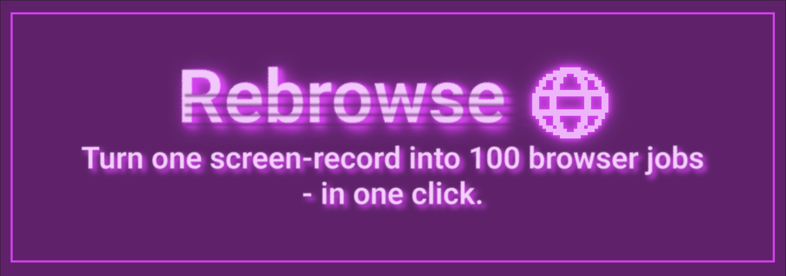
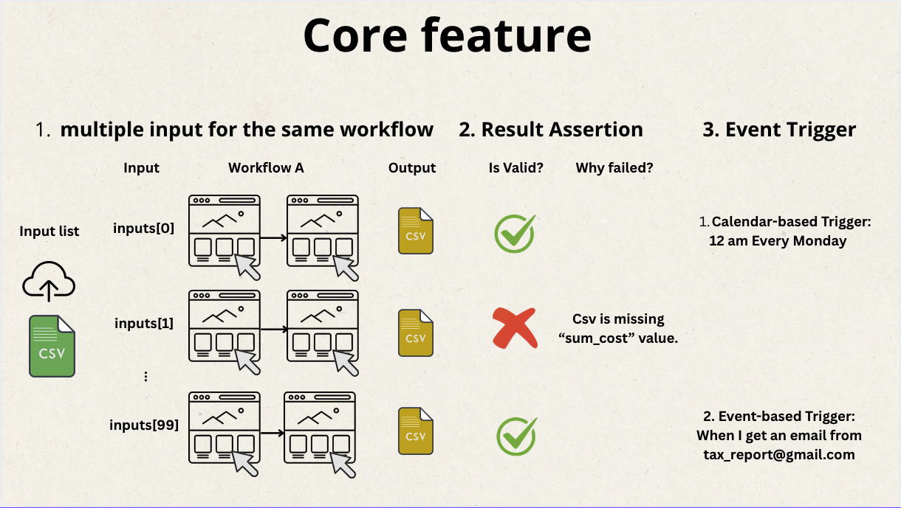
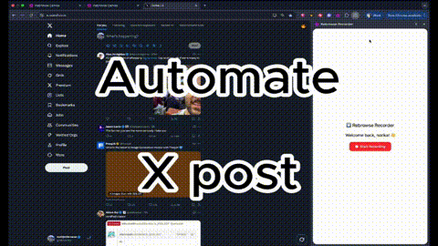

[](https://rebrowse.me)
[](https://x.com/n0rizkitty)
<br/>

## About Rebrowse

[Rebrowse]((https://rebrowse.me)) is a powerful tool that converts screen recordings into automated browser workflows.   

Upcoming features of Rebrowse(v0.2.0) :
[](https://rebrowse.me)

## Demo



## Repo structure

```bash
rebrowse-app
 L api/ # Web backend server on 127.0.0.1:8000
 L ui/  # Web frontend server on 127.0.0.1:5173
 L extension/ # Rebrowse Recorder Chrome extension.
```

## Installation Guide

### Preparation
1. Supabase(relational DB)   
Create a new project, and retrieve the follwoing valiables.
  - `SUPABASE_URL`: `https://YOUR_PROJECT_ID.supabase.co`
  - `SUPABASE_ANON_KEY`: public key
  - `SUPABASE_SERVICE_ROLE_KEY`: private key
  - `SUPABASE_JWT_SECRET`: private secret

2. OpenAI API Key

### Step 1: Clone the Repository
```bash
git clone https://github.com/zk1tty/rebrowse-app.git
cd rebrowse-app
```

### Step 2: Set up Chrome Extension: Rebrowse Recorder

1. Go to the dir and prep env file.
    ```bash
    cd extension
    cp .env.local .env
    ```

2. Prep `.env` file.
    ```bash
    # project ID
    VITE_SUPABASE_URL # https://YOUR_PROJECT_ID.supabase.co
    # anon pub key
    VITE_SUPABASE_ANON_KEY
    # prod URL
    VITE_API_URL # https://api.rebrowse.me
    VITE_APP_ORIGIN # https://app.rebrowse.me
    ```

3. Prepare the build file
    ```bash
    npm install
    npm run build:dev # upload recording data to 127.0.0.1:5173(dev)
    npm run build:prod # upload recording data to https://api.rebrowse.me(prod)
    ```
4. Check the build file `chrome-mv3` exists at `.output/` dir.
    ```bash
    ls .output
    # chrome-mv3
    ```
5. Open Chrome App, and go to `chrome://extension`

6. Upload `chrome-mv3` file on developer mode.

### Step 3: Set up Web Backend Server
1. Open a new terminal
2. Go to the dir and prep env file.
    ```bash
    cd api
    cp .env.local .env
    ```
3. Prep `.env` file.
    ```bash
    # We support all langchain models, openai only for demo purposes
    OPENAI_API_KEY=
    # Supabase Configuration
    SUPABASE_URL # https://YOUR_PROJECT_ID.supabase.co
    SUPABASE_SERVICE_ROLE_KEY
    SUPABASE_JWT_SECRET
    ```
4. Prep venv environment.   
    Note: we use `uv` for python venv management.
    ```bash
    # Install uv:
    curl -LsSf https://astral.sh/uv/install.sh | sh

    # Init venv
    uv venv --python 3.11
    source .venv/bin/activate

    # Manage Python packages with a pip-compatible interface
    uv install pip install -r requirement.txt

    # Run uvicorn
    ENV=prod uvicorn backend.api:app --reload
    ```
5. Confirm that public API responses.

### Step 4: Set up Web Frontend Server
1. Open a new terminal
2. go to the dir and prep env file
    ```bash
    cd ui
    cp .env.local .env
    ```
3. prep env file
    ```bash
    VITE_PUBLIC_API_URL # https://api.rebrowse.me
    VITE_PUBLIC_SUPABASE_URL # https://YOUR_PROJECT_ID.supabase.co
    VITE_PUBLIC_SUPABASE_ANON_KEY 
    ```
4. Install and run
    ```bash
    npm install
    npm run dev
    ```