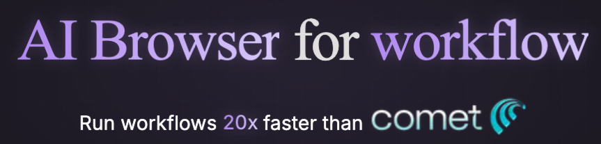
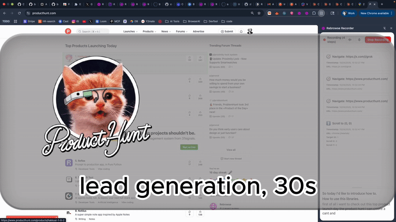
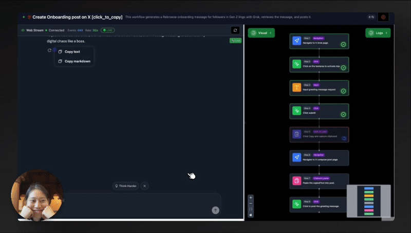
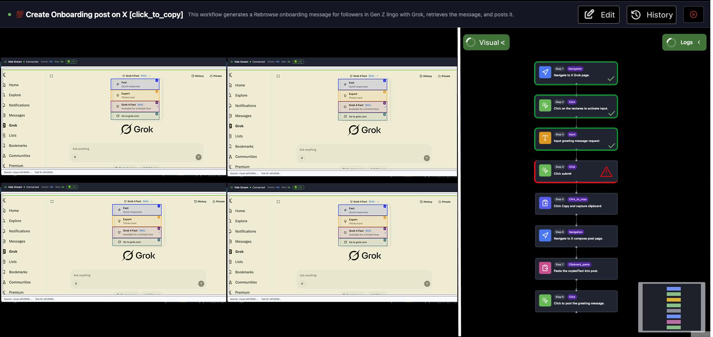
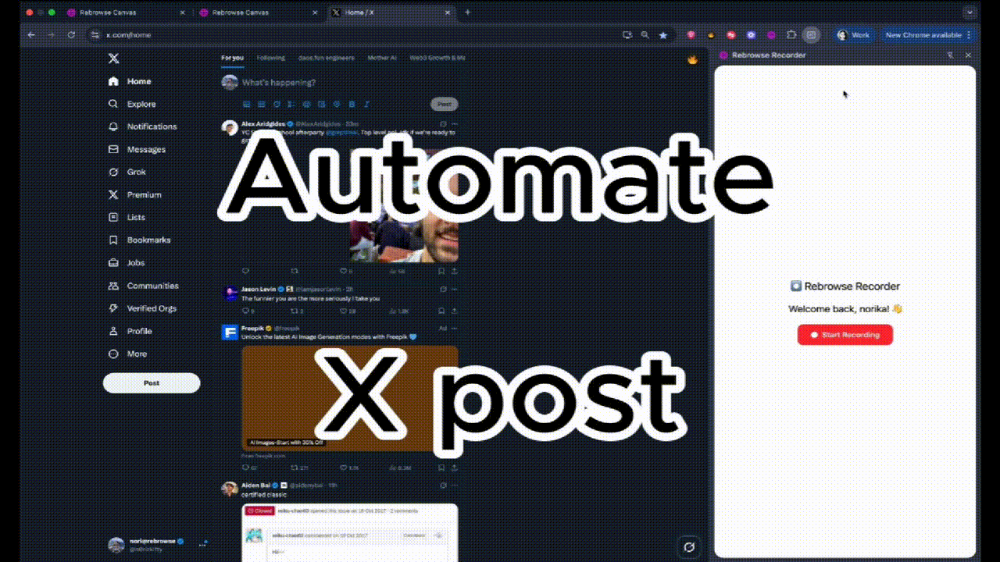
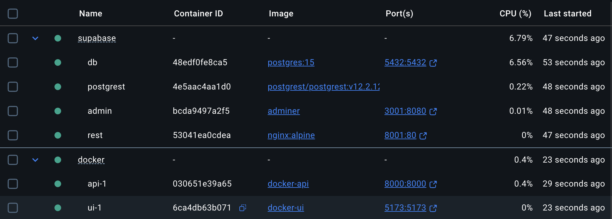

[](https://rebrowse.me)
[](https://x.com/n0rizkitty)
<br/>

## About Rebrowse

[Rebrowse](https://rebrowse.me) is self-learning browser recorder.   
It records what people browse, generates agentic browser workflows.   
So users can execute them on cloud browser in one click.   

## Problem to address

Most AI copilots are terrible at **workflow automation**.
They are 
- slow - "what takes so much time?"
- not deterministic - "you did this yesterday. Don't you remember?"
- low visibility - "what is happening?"
- call LLM thinking at every run - "dude, you think too much."

I'm solving these real problems.

## Remarkable Features

1. Screen-recording + voice = AI workflows: 
    - Create one deterministic workflow at first.  
    - Yopu can visually understand the flow with condifence.  
    
    

2. 20x Speed and 95% Accuracy
    - we use deterministic executions + customised flash-mode of browser-use.
    - It allows us to execute at 20x speed.

3. The world-first real-time **Preview**/**Evals** of **headless** browser 🙈
    - I used rrweb to ovecome CROS issues.
    - You can interact in real-time with the remote browser deployed under proxy on cloud.

    


3. Parallel-run(v0.2.0):
[](https://rebrowse.me)

## Showcase: Grok-powered X Bot



## Demo on prod:   

go to https://app.rebrowse.me

## Repo structure

```bash
rebrowse-app
 L api/ # Web backend server on 127.0.0.1:8000
 L ui/  # Web frontend server on 127.0.0.1:5173
 L extension/ # Rebrowse Recorder Chrome extension.
```

## Installtion Guide

#### **1. Production DB 🌩️** (with Supabase Cloud)
- quick start with shared workflows.
- good for learning how to use.
```bash
# 1. Clone the repository
git clone https://github.com/zk1tty/rebrowse-app.git
cd rebrowse-app

# 2. Update .env with your credentials:
#    - OpenAI API Key: https://platform.openai.com/api-keys
#    - Supabase credentials: https://supabase.com/dashboard

# 3. Start the application
bash docker/setup-docker.sh

# 4. Access the application!
# Frontend: http://localhost:5173
# Backend API: http://localhost:8000
```

- **Docker Containers**


#### **2. Self-Hosting DB 🏠** (with self-hosting Supabase)
- Start with a fresh workflow database.
- good for Entreprise test.
```bash
# 1. Clone the repository
git clone https://github.com/zk1tty/rebrowse-app.git
cd rebrowse-app

# 2. Update .env with your credentials:
#    - OpenAI API Key: https://platform.openai.com/api-keys

# 3. Run setup script with self-hosting flag
bash scripts/setup-docker.sh --self-host

# 4. Access the application!
# Frontend: http://localhost:5173
# Backend API: http://localhost:8000
# Database Admin: http://localhost:3001
# Database API: http://localhost:8001
```

- **Docker Containers**
